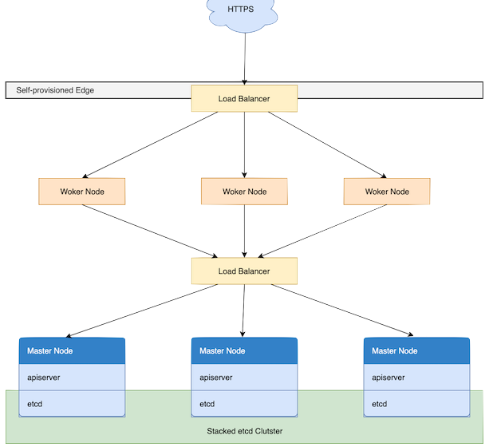
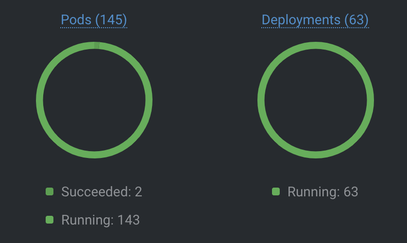
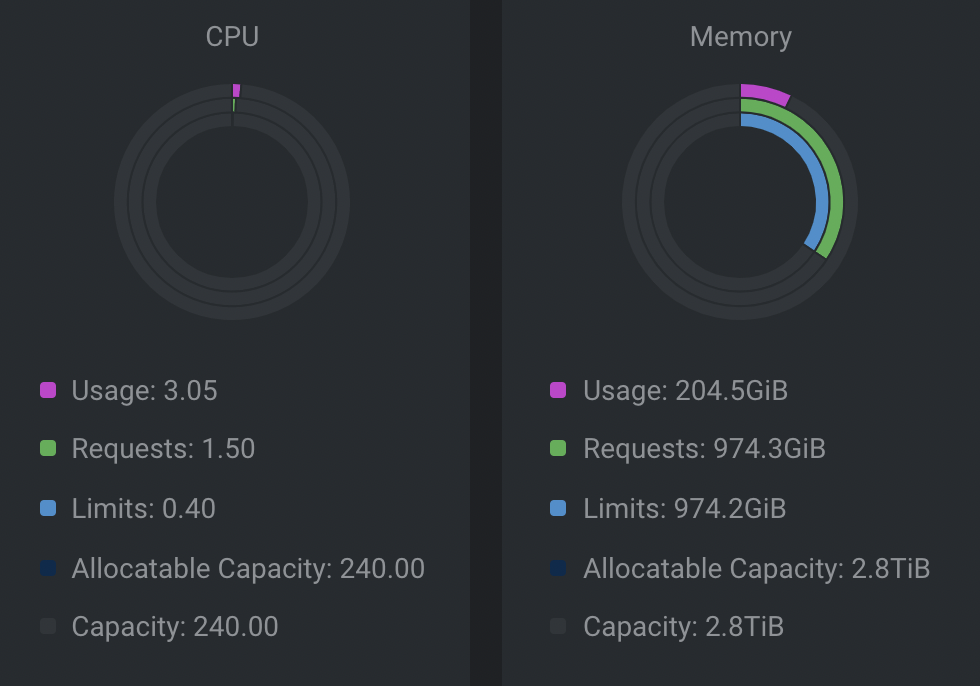
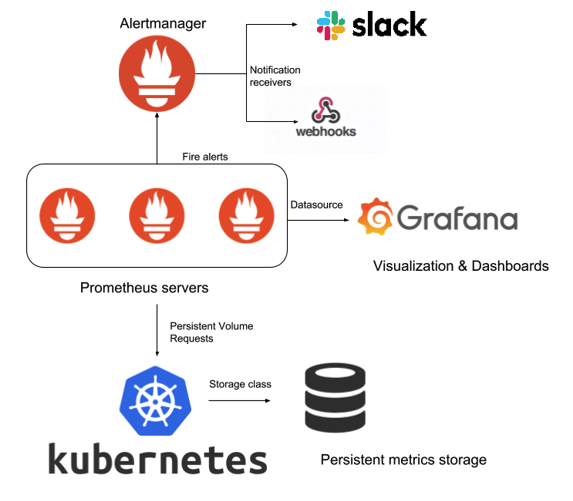
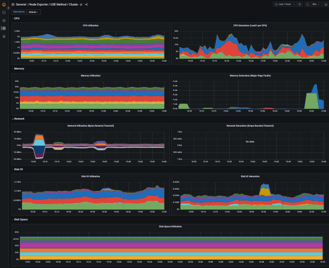
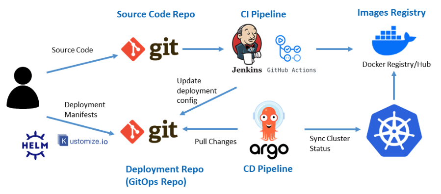
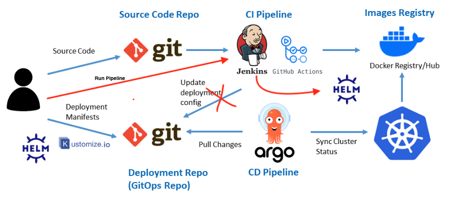
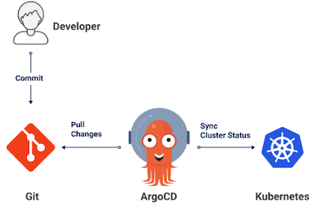
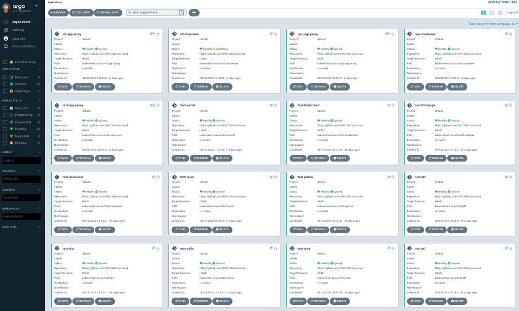
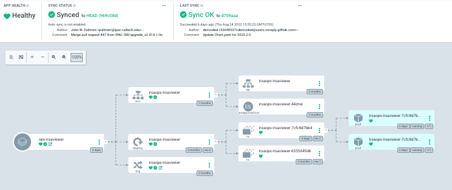

#### Introduction to IRSA Kubernetes

---

#### Design Objectives

- Multiple tenants
- Multiple projects
- Variety of environments
- Deployments from Firefly, IRSA UI, and IRSA Data System
- Environments: test, ops, and internal ops

---
#### Cluster Overview

 

OPS Cluster

DEV Cluster

 <li> Dynamic deployments
 <li> Multiple instances at different commit points

<!-- .element: class="fragment" -->

---

#### Maintenance

- Regular maintenance on the host machines
- Complete update of Kubernetes software stack
  - Every 6 months (incremental updates)
  - Docker: Container runtime
  - kubeadm: tool used to build Kubernetes clusters
  - Weave Net: Container Network Interface (CNI)
  - Ingress controller
- Kubernetes cordon

---

#### Monitoring Tools

- Zabbix and Xymon
- Prometheus
- Grafana
- Slack notification
- Dashboards

---

#### Automation

Typical GitOPS workflow

---

#### Our Deployment Process

- Manual execution of Jenkins pipeline
- Publishing chart to local Helm Chart Repository

---

#### What is irsajenkins

- Containerized and managed as code in Git
  - Plugins and configuration built into the image
- Support Docker/Compose (build/publish)
  - Isolation, consistency, portability
- Support Helm (create/publish)
- Automatically build and test on merge
- Slack notification

---

#### What is Argo CD

Automated GitOps tool for managing and deploying Kubernetes applications.
It aligns your cluster with Git-based declaratively-defined infrastructure, effectively automating application deployment.

---

#### Argo CD Dashboard

---

#### Argo CD Application

- Force Sync
- Update Kubernetes manifest
- View application logs

---

#### Conclusion

In summary, IRSA Kubernetes offers a robust solution for managing complex deployments across different environments.
We have firsthand positive experiences with the platform and that's why we're here to share our insights and knowledge with you today.
Thank You!

Any questions?